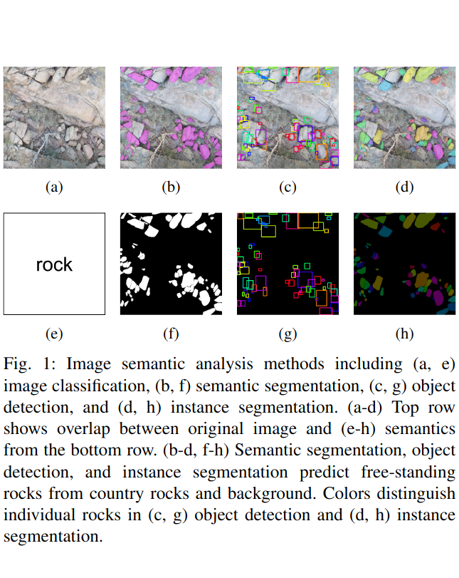

# Remote Sensing Instance Segmentation Algorithms (RSISA)

## Instance Segmentation
<div style="display: flex; justify-content: center;">
  
  
</div>

Instance segmentation generates pixel-level masks for each individual instance and assignes a unique label or identifier to each mask. This package provides efficient methods to address the two critical data-processing challenges that hinder instance segmentation applications in remote sensing.


## Installation
*Option 1*: `docker` (recommended) 
```
git clone https://github.com/ZhiangChen/instance_segmentation_remote_sensing.git
cd rsisa/docker
docker build -t rsisa .
docker run -p 8888:8888 -it --name rsisa -v $(pwd)/../:/root/rsisa/ rsisa
```
See [bash_help.md](./docker/bash_help.md) for more docker commands. The docker container configures the package environment, allowing to install the package in the container:
```
cd /root/rsisa/rsisa
pip install .
```

*Option 2*: `pip` (need to install requirements; see [setup.py](./rsisa/setup.py))
```
pip install rsisa
```

## Tutorial


## Test


