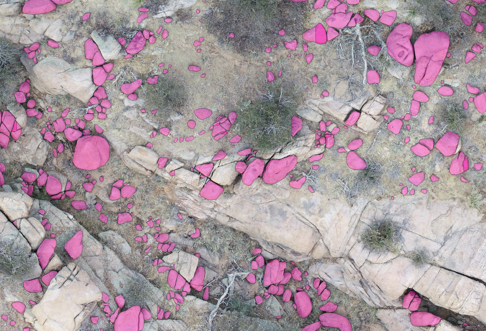

# Remote Sensing Instance Segmentation Algorithms (RSISA)

## Instance Segmentation
Instance segmentation offers distinct advantages in remote sensing applications compared to other image semantic analysis methods, such as image classification, object detection, and semantic segmentation. However, applying instance segmentation to remotely sensed images encounters two primary challenges: (1) annotation map splitting during pre-processing and (2) prediction instance mosaicing during post-processing. We develop data structures and algorithms to address these challenges, enabling instance segmentation for large-scale remote sensing applications. Based on our analytical solutions, the annotation map splitting algorithm has linear time complexity with respect to instance numbers. Leveraging the devised data structures, the instance registration algorithm mosaics prediction instances with the time complexity linear to prediction tile numbers, quadratic to the number of instances in a prediction tile, and linearithmic to the number of pixels in the largest prediction mask in a prediction tile. Through synthetic experiments featuring randomly generated ellipses, we validate the time complexity of the algorithms and estimate their space complexity. We introduce a method that utilizes unique code to track the instance registration process, allowing for the assessment of the algorithm effectiveness. High-resolution orthomosaics from Unpiloted Aircraft Systems and Structure-from-Motion techniques at Granite Dells, located near Prescott, Arizona, are employed for a real-world assessment of the proposed algorithms. The outcomes of these practical experiments demonstrate the applicability of the introduced algorithms in real-world scenarios.

<div style="display: flex; justify-content: center;">
  
  
</div>

**Note**: The data structures and algorithms are designed to improve time and space efficiency. You can have large-scale, real-world implementations on a laptop!  

## Installation
*Option 1*: `docker` (recommended) 
```
git clone https://github.com/ZhiangChen/instance_segmentation_remote_sensing.git
cd rsisa/docker
docker build -t rsisa .
docker run -p 8888:8888 -it --name rsisa -v $(pwd)/../:/root/rsisa/ rsisa
```
See [bash_help.md](./docker/bash_help.md) for more docker commands. The docker container configures the package environment, allowing to install the package in the container:
```
cd /root/rsisa/rsisa
pip install .
```

*Option 2*: `pip` (need to install requirements; see [setup.py](./rsisa/setup.py))
```
pip install rsisa
```

## Tutorials
*Synthetic data tutorial*:  
[jupyter_notebooks/synthetic_data_tutorial.ipynb](./jupyter_notebooks/synthetic_data_tutorial.ipynb) covers (1) random ellipse generation, (2) annotation map splitting, and (3) instance registration.

*Real data tutorial*:  
[jupyter_notebooks/real_data_tutorial.ipynb](./jupyter_notebooks/real_data_tutorial.ipynb) covers (1) annotation map splitting, (2) instance registration without instance segmentation, and (3) instance registration with instance segmentation. Figure 3 shows the instance registration results after Mask RCNN.

*Mask RCNN Tutorial*:  
Instance segmentation can be implemented with arbitrary models. We include Mask RCNN implementation in this repository. The corresponding tutorial can be found: [rsisa/mask_rcnn/mask_rcnn.ipynb](./rsisa/mask_rcnn/mask_rcnn.ipynb).

<div style="display: flex; justify-content: center;">
  
  
</div>
Figure 3: Applying instance segmentation algorithms in Granite Dells, located near Prescott, Arizona. (Left) Annotation map splitting algorithm generates annotation tiles with 10 m tile length and 1 m overlap. (Right) Instance registration algorithm produces a prediction map of individual rocks from Mask R-CNN prediction tiles.  


## Manuscript
Our manuscript is under review for IEEE Transactions on Image Processing. It is available upon request at zhiang.chen at caltech dot edu. 


